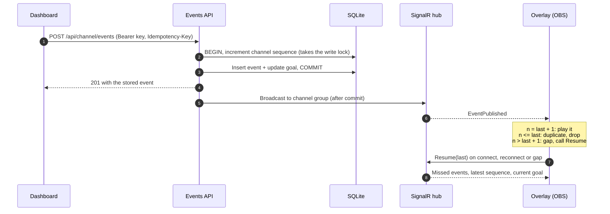

# ASP.NET Core SignalR Stream Overlay

[](https://github.com/arbaz168/aspnetcore-signalr-overlay/actions/workflows/ci.yml)


Real-time stream alerts and a live donation goal for OBS, built on ASP.NET Core SignalR and React. A dashboard sends events, and an overlay added to OBS as a browser source plays them on stream.

The demo version of this is easy: broadcast to a group, show a toast. The production version has to survive what a real stream does to it. **Overlays run for hours on home connections, OBS reloads them on scene changes, the server restarts mid-stream, and a raid sends 300 events in two seconds.** Every alert should play once, in order, and the goal bar should always be right. This project shows how I build for that, with tests for each guarantee.

## How it works



Every change an overlay needs to see (follows, subscriptions, donations, goal changes) is one event in **one ordered stream per channel**. Because the client knows the number of the last event it applied, it always knows exactly what it missed.

## Guarantees and the tests that prove them

| Problem | How it is handled | Test |
|---|---|---|
| Two publishers at the same moment | The sequence counter is incremented first, inside the transaction, so publishers queue on the channel's write lock | `ConcurrentPublishers_GetUniqueGapFreeSequenceNumbers` |
| A client retries a publish after a timeout | `Idempotency-Key` header, checked under the same lock and backed by a unique index | `SameRequestRetriedWithTheSameKey_IsStoredAndBroadcastOnce` |
| Retries racing each other | Same lock: exactly one is created, the rest get the original back | `ConcurrentRetriesOfOneRequest_AreStoredOnce` |
| A key reused for a different event | Rejected with `422`, nothing stored | `KeyReusedForADifferentEvent_IsRejected_AndNothingIsStored` |
| A rejected duplicate burning a number | The rollback returns it, so sequences stay gap-free | `DuplicateRequest_DoesNotUseUpASequenceNumber` |
| Broadcasts arriving out of order | Client detects the gap, buffers, fetches what is missing | `sequencer.test.ts` |
| Overlay offline for a moment | `Resume(last)` returns exactly the missed events, in order | `ReconnectingOverlay_GetsWhatItMissed_InOrder` |
| Overlay offline for an hour | Events older than the replay window are skipped, but the goal is state, so it is always current | `StaleEvents_AreNotReplayed_ButTheGoalIsStillCurrent` |
| Huge backlog | Replay is capped to the newest events | `Replay_IsCappedToTheNewestEvents` |
| Server database reset | The server's latest sequence is authoritative, even when it is behind the client | `ClientAheadOfTheServer_GetsNothing_AndIsToldTheRealLatestSequence` |
| A raid of hundreds of events | Alert queue plays one at a time and folds overflow into one summary alert | `alertQueue.test.ts` |
| Leaked overlay token | Read-only: it can connect and listen, never publish or change the goal | `OverlayToken_CannotPublishOrChangeTheGoal` |
| Keys in a database dump | Only SHA-256 hashes are stored; keys are shown once at creation | `NewChannel_ReturnsBothKeysOnce_AndStoresOnlyTheirHashes` |
| Keys in URLs and logs | Query string tokens are accepted on the hub only, where browsers leave no choice | `KeyInTheQueryString_IsIgnoredOutsideTheHub` |
| One channel seeing another's events | Hub groups per channel, taken from the authenticated key, never from client input | `OverlayOnAnotherChannel_ReceivesNothing` |

**35 backend tests** run against the real HTTP pipeline, a real SQLite file and real SignalR clients (long polling over the in-memory test server), with a fake clock for the replay window. **14 frontend tests** cover the client-side ordering and the alert queue.

## Design decisions

- **Sequence numbers over timestamps.** Clocks drift and two events can share a millisecond. A per-channel counter gives a total order and makes "what did I miss?" a single comparison.
- **Increment first, then check.** The `UPDATE ... RETURNING` on the channel row is the first statement in the transaction. On PostgreSQL or SQL Server that is a row lock, so concurrent publishers on one channel queue while different channels never block each other. The idempotency check that follows is then race-free without a retry loop. (SQLite locks the whole database, which is fine for a demo.)
- **Broadcast after commit.** A client never sees an event that was rolled back. If the process dies between commit and broadcast, clients recover the event at the next gap check or reconnect.
- **The client owns ordering.** SignalR delivers each connection's messages in order, but two concurrent publishers can broadcast in either order, and a reconnect can drop messages. The client applies `last + 1`, drops anything older and resumes on a gap. This also keeps working unchanged with a scale-out backplane.
- **Replay recent events only.** An overlay that was offline for an hour should not play an hour of alerts on stream. The goal is state rather than history, so it is sent in full on every resume, and each event carries the goal as it stood after it.
- **Position survives reloads.** OBS reloads browser sources when scenes change, so the overlay keeps its last sequence in `localStorage` and resumes instead of replaying or dropping. A brand new overlay starts at the latest position without playing old alerts.
- **Two keys per channel.** The dashboard key publishes over HTTP. The overlay token only listens. The hub has no methods that change anything, so a token copied out of a stream setup can do no harm.
- **Token in the URL fragment.** The overlay URL is `/overlay.html#token=...`. Browsers never send the fragment to the server, so it stays out of access logs. Browser WebSockets cannot send headers, so the token does go in the query string of the hub connection itself. That one exception is limited to the hub path, and ASP.NET Core request logging stays at `Warning`.
- **Reconnect forever, with jitter.** An overlay has no one watching it. It retries with exponential backoff capped at 30 seconds and never gives up, apart from a `401`, which retrying cannot fix.
- **Money in minor units.** Amounts are integers in the channel's currency, formatted with that currency's own decimals (JPY has none).

## Why SignalR, not raw WebSockets

The production overlays I run for [Sponsa](https://sponsa.app) use raw WebSockets: `UseWebSockets` and a small handler, one message shape, one process. That was the right size for that system. This demo uses SignalR on purpose, because it is what I would reach for when the feature grows:

- **Groups, auth and hub methods are built in.** Per-channel groups, the token check on connect and the `Resume` call are a few lines each. With raw WebSockets I write the subscription registry, message framing and request/response matching myself.
- **Transport fallback.** SignalR negotiates WebSockets and falls back to Server-Sent Events or long polling. The integration tests use long polling over the in-memory test server, so they run real clients without opening sockets.
- **Scale-out is a configuration change.** A Redis backplane or Azure SignalR Service fans broadcasts out across instances. Raw WebSockets need that plumbing written by hand.

The cost is a client library, a negotiate round trip and a protocol on top of the socket. The ordering guarantees do not depend on either choice: sequence numbers, resume and idempotency sit above the transport and would work unchanged over a plain WebSocket.

## Run it

Requires the [.NET 10 SDK](https://dotnet.microsoft.com/download) and Node.js 22 or later. No Docker needed.

```bash
cd web && npm ci && npm run build && cd ..
dotnet run --project src/LiveOverlay.Api --launch-profile http
```

Open http://localhost:5080, create a channel, and copy the overlay URL into OBS as a browser source (1920 × 1080). Or open it in another browser tab. Then send events from the dashboard. **Burst × 20** sends twenty donations at once.

For frontend work with hot reload, run the API as above and `npm run dev` in `web/`. Vite proxies `/api` and `/hubs` to the API.

```bash
dotnet test --solution LiveOverlay.slnx
```

```bash
cd web && npm test
```

### API

| Method | Path | Auth | Purpose |
|---|---|---|---|
| `POST` | `/api/channels` | none | Create a channel. Returns the dashboard key and overlay token, once |
| `GET` | `/api/channel` | dashboard key | Channel summary and current goal |
| `POST` | `/api/channel/events` | dashboard key | Publish a follow, subscription or donation. `Idempotency-Key` required |
| `PUT` | `/api/channel/goal` | dashboard key | Start a new goal. `Idempotency-Key` optional |
| `WS` | `/hubs/overlay` | key or token | `EventPublished` and `OverlaysChanged` pushes, `Resume(afterSequence)` |
| `GET` | `/health` | none | Health check |

### Configuration

| Setting | Default | Meaning |
|---|---|---|
| `Overlay:ReplayWindow` | `00:05:00` | Events older than this are not replayed on resume |
| `Overlay:MaxReplayEvents` | `50` | Most events returned by one resume |
| `ConnectionStrings:Overlay` | `Data Source=overlay.db` | SQLite file |

## Project layout

```text
src/LiveOverlay.Api
  Channels/   channel creation, hashed keys, HTTP endpoints
  Events/     event model, validation, the publisher (sequence, idempotency, broadcast)
  Realtime/   SignalR hub (groups, resume) and overlay presence
  Security/   bearer key authentication for HTTP and the hub
  Data/       EF Core context and migrations
tests/LiveOverlay.Tests
  real HTTP and SignalR clients against the in-memory server
web/src
  shared/     hub connection, event sequencer, alert queue, API client
  dashboard/  create a channel, send events, set the goal, live activity
  overlay/    the OBS browser source: alerts and goal bar
```

## What I would add for a larger production system

- **Scale-out.** Azure SignalR Service or a Redis backplane for broadcasts, and the overlay presence count moved from memory to Redis. The ordering and resume logic already work unchanged across instances.
- **PostgreSQL**, where the sequence increment is a row lock, so busy channels do not slow down quiet ones.
- **An outbox** between commit and broadcast, so a crash cannot delay an alert until the next event.
- **Token rotation** with live disconnect of overlays using the old token, and rate limits on publishing per channel.
- **Real user accounts** for the dashboard. It keeps its key in `localStorage` here, which is fine for a local demo and not for production.
- **Metrics**: connected overlays, broadcast latency, resume counts and gap frequency, with alerts.

## License

[MIT](LICENSE)
